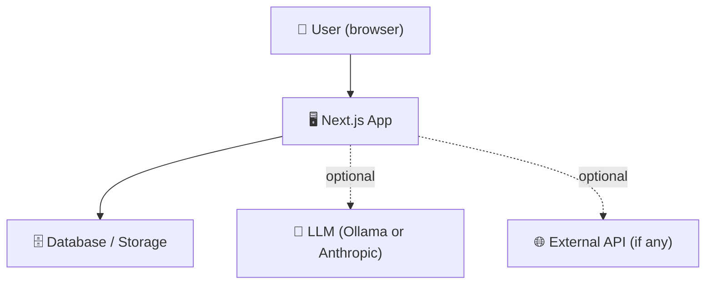
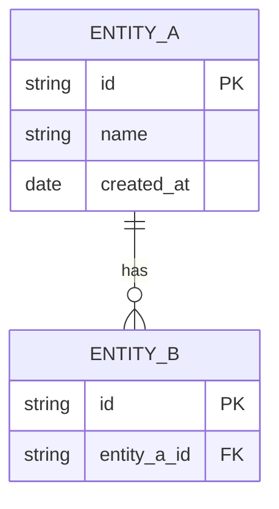
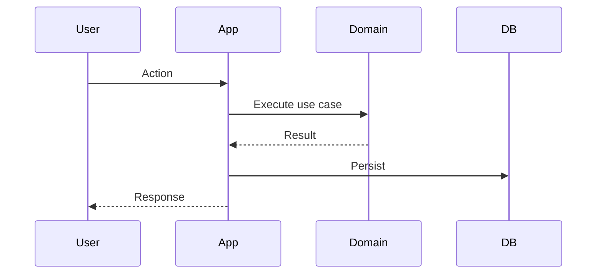

# Architecture — {{PROJECT_NAME}}

## System overview

_1–2 sentences describing what this system does and its main moving parts._

---

## Reference architecture

_Select one at kickoff and delete the others._

- **Pattern A — Local-first**: Next.js + SQLite/file system. Data stays on Mac. Free forever.
- **Pattern B — Cloud-backed**: Next.js + Supabase (Postgres + RLS). Cloud data, EU region.
- **Pattern C — AI-powered**: Pattern A or B + LLM adapter (Ollama local or Anthropic cloud).
- **Pattern D — Script/CLI**: Python + local file system. No web UI.

**Selected:** _Pattern X — [name]_ (see ADR-001)

---

## Context diagram



---

## Layer structure

```
src/
  app/          ← Next.js pages, API routes, layout (framework layer)
  components/   ← React UI components (presentation layer)
  application/  ← Use cases, commands, queries (application layer)
  domain/       ← Pure business logic, no framework deps (domain layer)
  infra/        ← DB, API clients, LLM adapters (infrastructure layer)
  types/        ← Shared TypeScript types
```

**Layer dependency rules:**
- `domain/` — no imports from any other layer
- `application/` — imports `domain/` only
- `infra/` — imports `domain/` and `application/`
- `components/` — imports `domain/` and `application/`
- `app/` — imports everything, wires adapters

---

## Data model

_Add an ER diagram when you have a schema._



---

## Key flows

_One sequence diagram per non-obvious flow._



---

## Infrastructure & deployment

| Concern | Choice | Why |
|---------|--------|-----|
| Hosting | Vercel (Hobby) | Auto-deploy from main branch, free tier |
| Database | _TBD_ | |
| LLM | _Ollama (local) / Anthropic API_ | |
| Auth | _None / Supabase Auth_ | |
| Error monitoring | _Sentry (free tier)_ | |

---

## Cost model

_Updated at kickoff and whenever services change._

| Service | Free tier | Paid trigger | Monthly if paid |
|---------|-----------|-------------|----------------|
| Vercel | Hobby: 100GB BW | >100GB or team | $20/month |
| Supabase | 500MB DB, 2 projects | >500MB | $25/month |
| Anthropic | Pay-per-use | Per token | Varies |
| Sentry | 5k errors/month | >5k | $26/month |
| Ollama | Free forever | Never | $0 |
| SQLite (local) | Free forever | Never | $0 |

**Current estimated monthly cost:** $0 (_free tier_)

---

## Security tier

_Select at kickoff:_

- **Tier 1 — Personal/local**: Data on Mac only. OS protection sufficient.
- **Tier 2 — Client data in cloud**: Supabase RLS + EU region + HTTPS. No client data in LLM prompts without consent.
- **Tier 3 — Highly sensitive**: Local only, Ollama for AI. No cloud services.

**Selected:** Tier _X_

---

## Architecture Decision Records

| ADR | Decision | Status |
|-----|---------|--------|
| [ADR-001](decisions/ADR-001-stack.md) | Stack and reference architecture choice | Accepted |

---

_Last updated: [date]_
