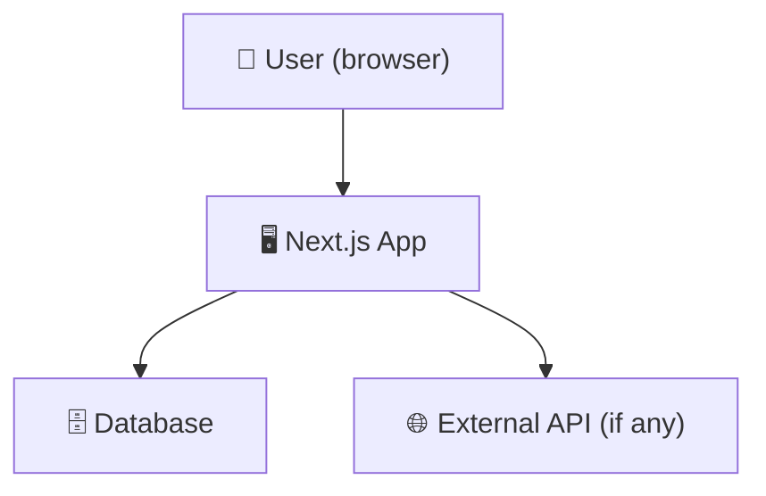
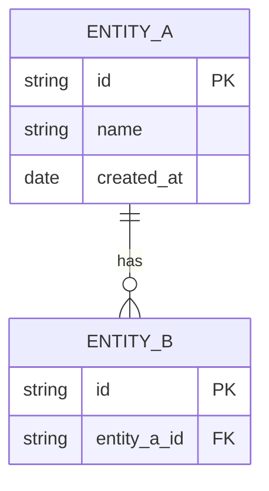
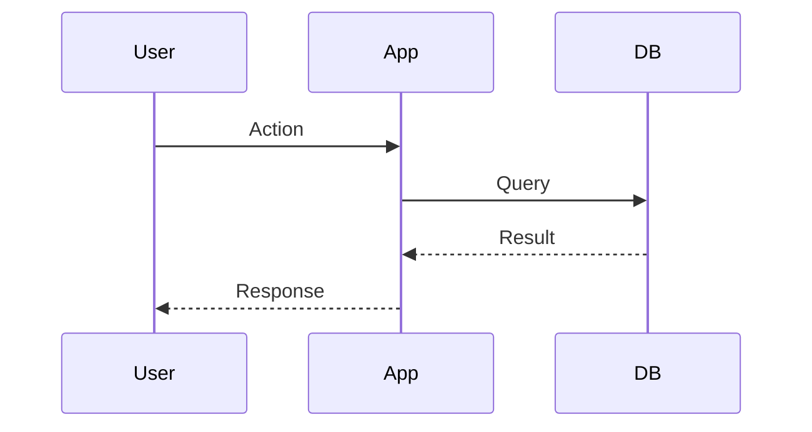

# Architecture

## System overview

_1–2 sentences describing what this system does and its main moving parts._

---

## Context diagram

_Who/what interacts with this system? Use this to orient anyone new._



---

## Layer structure

```
src/
  app/        ← Next.js pages, API routes, layout (framework layer)
  components/ ← React UI components (presentation layer)
  domain/     ← Pure business logic, no framework deps (domain layer)
  infra/      ← Database clients, API clients, file system (infrastructure layer)
  types/      ← Shared TypeScript types
```

**Rule:** `domain/` must never import from `app/`, `components/`, or `infra/`.
This keeps business logic testable and framework-independent.

---

## Data model

_Add an ER diagram when you have a schema. GitHub renders Mermaid inline._



---

## Key flows

_Add sequence diagrams for non-obvious flows. One diagram per flow._



---

## Infrastructure & deployment

| Concern | Choice | Why |
|---------|--------|-----|
| Hosting | Vercel | Auto-deploy from main branch |
| Database | _TBD_ | |
| Auth | _TBD_ | |

---

_Last updated: [date]_
