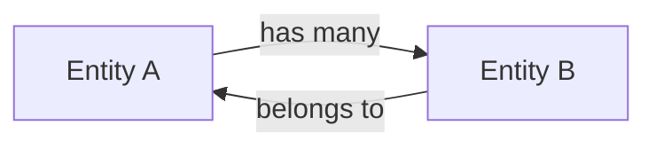

# Domain Model

> The domain model defines the core concepts of this app and the language used everywhere —
> in code, in conversations, in documentation. If the word means something specific here,
> it belongs in this file.

---

## Ubiquitous language

_The shared vocabulary. Use these exact words in code (variable names, function names, types),
in conversations, and in docs. Ambiguous language = ambiguous code._

| Term | Definition |
|------|-----------|
| _Term_ | _What it means in this app's context_ |

---

## Core entities

_The main "things" this app manages. Each entity has an identity (an ID) that persists over time._

### [EntityName]

_What it represents. Why it exists._

```ts
// Minimal representation — expand as needed
type EntityName = {
  id: string
  // ...
}
```

**Rules:**
- _Business rule 1 (e.g. "a client must have at least one contact")_
- _Business rule 2_

---

## Relationships



---

## Key operations

_The meaningful things that happen in this domain. These become the functions in `src/domain/`._

| Operation | Inputs | Output | Rule |
|-----------|--------|--------|------|
| _doSomething_ | _entity, params_ | _result_ | _constraint_ |

---

_Last updated: [date]_
